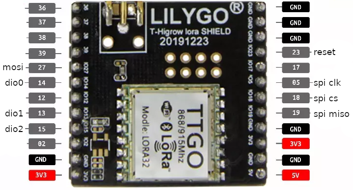
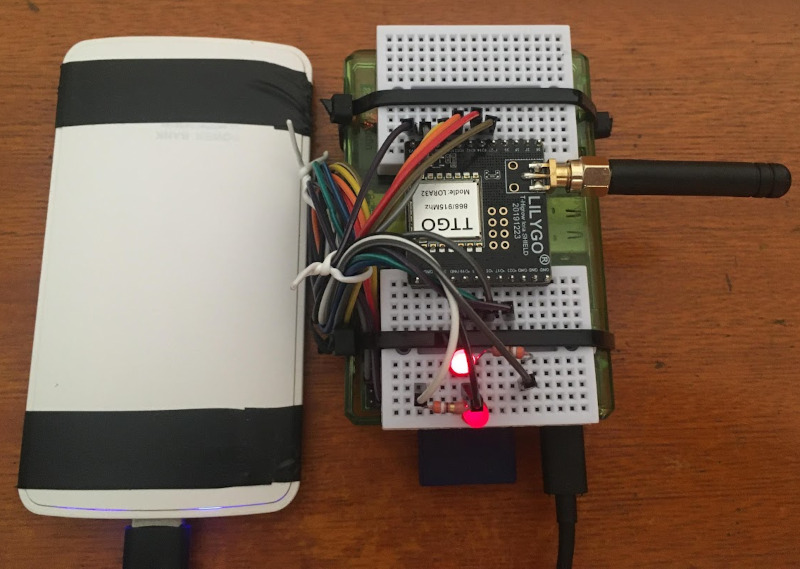

# TTGO32 shield on Pi
This is a quick bootstrapper to use the TTGO32 LoRa shield on a Raspberry Pi with some examples.

LilyGO TTGO32 shield is a cheap LoRa shield based on SX1276 that is meant to be used with ESP32 devices, but it implements a standard `SPI+DIO` protocol that could be used by any device. Being a standalone shield means that it is cheaper than buying a LoRa "solution" with a bunch of parts. A Raspberry Pi has all of the requirements for talking to this shield and to provide a better learning experience for those starting LoRa development.

# Wiring up everything

## LilyGO TTGO32 shield pinout

**Warning:** The diagram for the LilyGO TTGO32 shield found online is wrong! I've updated the pinout based on [this example code](https://github.com/Xinyuan-LilyGO/LilyGO-T-HiGrow-LoRaWLAN) supplied by LilyGO.



## Raspberry Pi pinout

This pinout was selected to be compatible even with the first Raspberry Pi, but it can be changed freely as long as the code is changed accordingly.

| Function | Pi (header) | Pi (GPIO) | Shield |
|----------|-------------|-----------|--------|
| 3v3      | PIN 1       | ---       | 3v3    |
| Ground   | PIN 6       | ---       | Ground |
| SPI MISO | PIN 21      | ---       | PIN 19 |
| SPI MOSI | PIN 19      | ---       | PIN 27 |
| SPI CLK  | PIN 23      | ---       | PIN 5  |
| SPI CE0  | PIN 24      | GPIO8     | PIN 18 |
| DIO0     | PIN 11      | GPIO17    | PIN 14 |
| DIO1     | PIN 12      | GPIO18    | PIN 13 |
| DIO2     | PIN 15      | GPIO22    | PIN 15 |
| RESET    | PIN 18      | GPIO24    | PIN 23 |
| LED PING | PIN 22      | GPIO25    | ---    |
| LED ACK  | PIN 16      | GPIO23    | ---    |

Refer to Raspberry Pi's pinout diagram to ensure everything is connected properly.

The connection with the shield is done through SPI and three other pins called DIO, which are used to signal some types of events. The shield is powered by Pi's 3.3 Volt regulator without any additional hardware required. The 5 Volt pin on the shield is not used at all and it is there just for labeling. There are also two optional LED's meant for the pinger program, those can be used in a headless setup to test transmission range between two devices. The Pi and the shield have multiple 3v3 and ground pins, but only one of each need to be connected.

The LED's must be connected to a 330 Ohm resistor and then connected to ground:

```
GPIO PIN ----- + LED - ---|\/\/\/\|--- GROUND
```

# Building LoRa programs

This bootstrapper depends on the LMIC library to do the heavy lifting, which needs to be configured. **Warning: A bad configuration might damage your shield!**

LMIC supports a wide range of LoRa configurations, these are determined by the regulations of each country. The selected configuration must match the hardwre of the shield itself, like frequency range, otherwise it might damage the radio components of the device if kept operating outside its designed specification. **This also means that any changes in the LoRa hardware may require a recompilation.**

This project tries to keep everything in a single folder, so it relies on a few scripts to property set the environment variables. Once built, the bootstrapper folder cannot be moved, this is a limitation of the piduino's database that may be fixed in the future.

First, clone the repository with its dependencies:

```
git clone --recursive
```

Next, edit LMIC's configuration file to select your frequency/region (see LMIC's README.md for more information):

```
vim deps/arduino-lmic/project_config/lmic_project_config.h
```

Then build the project dependencies:

```
./build_deps.sh
```

Finally compile the test programs located in the src directory, for instance the pinger:

```
./build_src.sh src/pinger.cpp pinger
```

To execute the built program (usually requires sudo):

```
sudo ./run.sh ./pinger
```

# Pinger

Pinger is a simple program that broadcasts a hello message and tries to read back the same message. It serves as a quick validation program and an easy way to measure transmission distance between two devices. Besides printing the result to `stdout`, it also uses two optional LED's to indicate if it is running and if it is succeeding at receiving the message back, so it can be used in a headless setup:



# Headless & Startup at boot

You can add a custom event to `cron` with the `@reboot` specification to make any program start at boot in headless mode. Make sure to use `sudo crontab -e` to ensure it will run as root, and the `run.sh` script to ensure the environment variables are set.